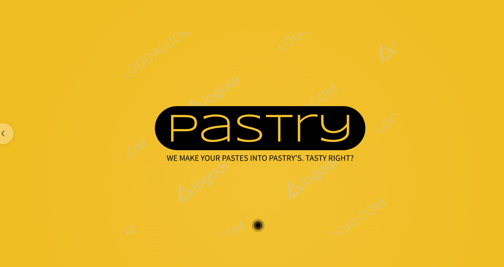

# Pastry: Minimal & Fast PasteBin App



## Description

**Pastry** is a straightforward PasteBin-inspired web application designed for pasting and sharing text content through unique URLs. It offers a user-friendly interface, making it effortless to share code snippets, text notes, and more with others.

## Installation Instructions

1. **Clone the Repository:**
   ```sh
   git clone <repository-url>
   cd pastry
   ```

2. **Install Dependencies:**
   ```sh
   npm install
   ```

3. **Run the Application:**
   ```sh
   node server.js
   ```

4. **Access the App:**
   Open your browser and go to [http://localhost:8080](http://localhost:8080).

## Dependencies

- **express**: Web framework for Node.js.
- **body-parser**: Middleware for parsing incoming request bodies.
- **crypto**: Node.js module for cryptographic operations.
- **sqlite3**: SQLite database driver.

## Directory Structure

```
pastry/
├── index.html
├── style.css
├── server.js
└── pastes.db
```

## Total Lines of Code

Approximately less than 200 lines of code. 

## Features

- Simple and intuitive web interface.
- Generates random URLs for pastes.
- Persists pastes using SQLite database.
- Basic CSS styling for an appealing look.
- Fast setup and minimalistic design.

## Usage

1. Visit the homepage and enter your content in the text area.
2. Click "Submit" to generate a unique URL for your paste.
3. Share the URL with others to access your paste.

## Notes

- This application is for educational and basic usage.
- SQLite database is used for demonstration, not for production.
- Additional security measures, error handling, and user management recommended for production.

## Contributions

Contributions are welcome! Submit issues or pull requests on [GitHub](https://github.com/lordofwizard/pastry.git).

## License

This project is licensed under the [MIT License](LICENSE).

---

Feel free to tailor and enhance "Pastry" to suit your needs or as a foundation for a more feature-rich PasteBin application.

